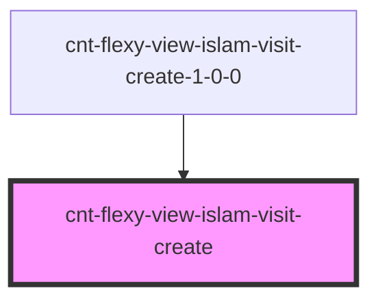

# cnt-flexy-view-islam-visit-create

<!-- Auto Generated Below -->

## Properties

| Property  | Attribute | Description                        | Type                             | Default     |
| --------- | --------- | ---------------------------------- | -------------------------------- | ----------- |
| `intro`   | --        | Приём данных из массива для вывода | `CntFlexyViewIslamVisitCreate[]` | `[]`        |
| `payload` | `payload` |                                    | `any`                            | `undefined` |

## Events

| Event                      | Description                        | Type               |
| -------------------------- | ---------------------------------- | ------------------ |
| `clickCreateImage`         | Клик по картинке                   | `CustomEvent<any>` |
| `clickCreatePositionImage` | Клик по позиционированной картинке | `CustomEvent<any>` |
| `clickCreateSecondSubText` | Клик по второму subtext            | `CustomEvent<any>` |
| `clickCreateSecondText`    | Клик по второму тексту             | `CustomEvent<any>` |
| `clickCreateSubText`       | Клик по subtext                    | `CustomEvent<any>` |
| `clickCreateText`          | Клик по тексту                     | `CustomEvent<any>` |
| `clickCreateThirdSubText`  | Клик по третьему subtext           | `CustomEvent<any>` |
| `clickCreateThirdText`     | Клик по третьему тексту            | `CustomEvent<any>` |
| `clickCreateTitle`         | Клик по title                      | `CustomEvent<any>` |

## Dependencies

### Used by

 - [cnt-flexy-view-islam-visit-create-1-0-0](../../..)

### Graph

----------------------------------------------

*Built with [StencilJS](https://stenciljs.com/)*
