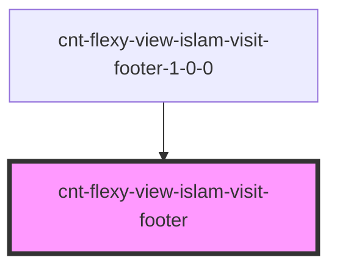

# cnt-flexy-view-islam-visit-footer

<!-- Auto Generated Below -->

## Properties

| Property     | Attribute    | Description                        | Type                             | Default     |
| ------------ | ------------ | ---------------------------------- | -------------------------------- | ----------- |
| `categories` | `categories` |                                    | `any`                            | `undefined` |
| `intro`      | --           | Приём данных из массива для вывода | `CntFlexyViewIslamVisitFooter[]` | `[]`        |

## Events

| Event                | Description     | Type               |
| -------------------- | --------------- | ------------------ |
| `clickFooterPrivacy` | Клик по privacy | `CustomEvent<any>` |
| `clickFooterSubText` | Клик по subtext | `CustomEvent<any>` |
| `clickFooterSupport` | Клик по support | `CustomEvent<any>` |
| `clickFooterText`    | Клик по text    | `CustomEvent<any>` |

## Dependencies

### Used by

 - [cnt-flexy-view-islam-visit-footer-1-0-0](../../..)

### Graph

----------------------------------------------

*Built with [StencilJS](https://stenciljs.com/)*
