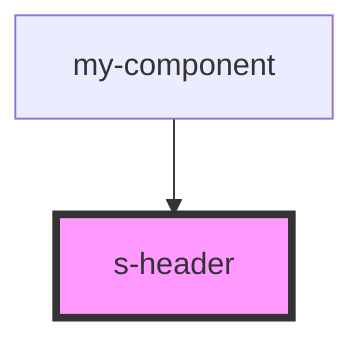

# s-header

<!-- Auto Generated Below -->

## Properties

| Property    | Attribute    | Description | Type  | Default     |
| ----------- | ------------ | ----------- | ----- | ----------- |
| `forHeader` | `for-header` |             | `any` | `undefined` |

## Dependencies

### Used by

 - [my-component](../../../../my-component)

### Graph

----------------------------------------------

*Built with [StencilJS](https://stenciljs.com/)*
