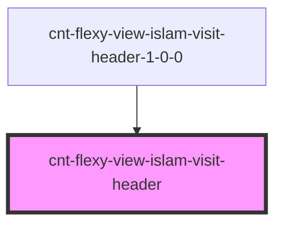

# s-header

<!-- Auto Generated Below -->

## Properties

| Property     | Attribute    | Description                        | Type                             | Default     |
| ------------ | ------------ | ---------------------------------- | -------------------------------- | ----------- |
| `categories` | `categories` |                                    | `any`                            | `undefined` |
| `intro`      | --           | Приём данных из массива для вывода | `CntFlexyViewIslamVisitHeader[]` | `[]`        |

## Events

| Event               | Description      | Type               |
| ------------------- | ---------------- | ------------------ |
| `clickHeaderImage`  | Клик по картинке | `CustomEvent<any>` |
| `clickHeaderLogIn`  | Клик по log in   | `CustomEvent<any>` |
| `clickHeaderSignUp` | Клик по sign up  | `CustomEvent<any>` |

## Dependencies

### Used by

 - [cnt-flexy-view-islam-visit-header-1-0-0](../../..)

### Graph

----------------------------------------------

*Built with [StencilJS](https://stenciljs.com/)*
