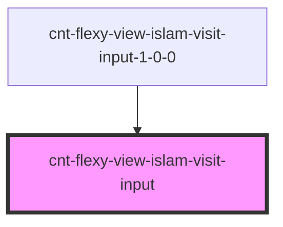

# cnt-flexy-view-islam-visit-input

<!-- Auto Generated Below -->

## Properties

| Property  | Attribute | Description                        | Type                            | Default     |
| --------- | --------- | ---------------------------------- | ------------------------------- | ----------- |
| `intro`   | --        | Приём данных из массива для вывода | `CntFlexyViewIslamVisitInput[]` | `[]`        |
| `payload` | `payload` |                                    | `any`                           | `undefined` |

## Events

| Event              | Description    | Type               |
| ------------------ | -------------- | ------------------ |
| `clickInput`       | Клик по Input  | `CustomEvent<any>` |
| `clickInputButton` | Клик по кнопке | `CustomEvent<any>` |
| `clickInputText`   | Клик по тексту | `CustomEvent<any>` |

## Dependencies

### Used by

 - [cnt-flexy-view-islam-visit-input-1-0-0](../../..)

### Graph

----------------------------------------------

*Built with [StencilJS](https://stenciljs.com/)*
