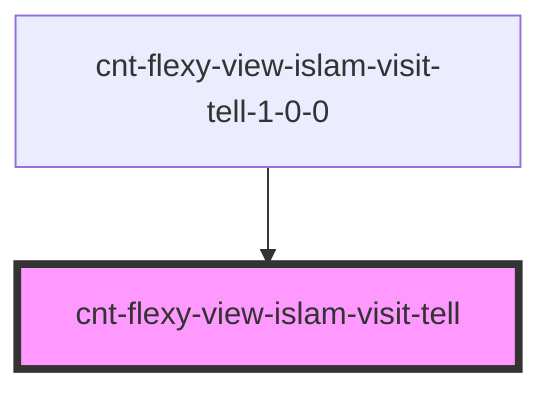

# cnt-flexy-view-islam-visit-tell

<!-- Auto Generated Below -->

## Properties

| Property  | Attribute | Description                        | Type                           | Default     |
| --------- | --------- | ---------------------------------- | ------------------------------ | ----------- |
| `intro`   | --        | Приём данных из массива для вывода | `CntFlexyViewIslamVisitTell[]` | `[]`        |
| `payload` | `payload` |                                    | `any`                          | `undefined` |

## Events

| Event                  | Description         | Type               |
| ---------------------- | ------------------- | ------------------ |
| `clickTellAppImage`    | Клик по AppImage    | `CustomEvent<any>` |
| `clickTellGoogleImage` | Клик по GoogleImage | `CustomEvent<any>` |
| `clickTellSubText`     | Клик по subtext     | `CustomEvent<any>` |
| `clickTellText`        | Клик по тексту      | `CustomEvent<any>` |
| `clickTellTitle`       | Клик по title       | `CustomEvent<any>` |

## Dependencies

### Used by

 - [cnt-flexy-view-islam-visit-tell-1-0-0](../../..)

### Graph

----------------------------------------------

*Built with [StencilJS](https://stenciljs.com/)*
