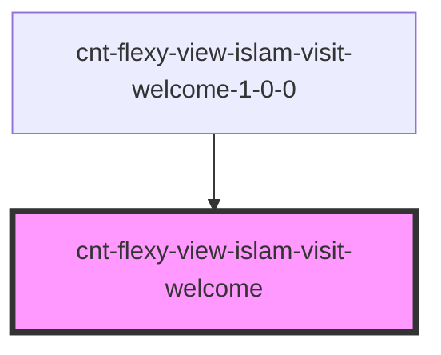

# s-welcome

<!-- Auto Generated Below -->

## Properties

| Property  | Attribute | Description                        | Type                              | Default     |
| --------- | --------- | ---------------------------------- | --------------------------------- | ----------- |
| `intro`   | --        | Приём данных из массива для вывода | `CntFlexyViewIslamVisitWelcome[]` | `[]`        |
| `payload` | `payload` |                                    | `any`                             | `undefined` |

## Events

| Event               | Description        | Type               |
| ------------------- | ------------------ | ------------------ |
| `clickWelcomeImage` | Клик по картинке   | `CustomEvent<any>` |
| `clickWelcomeText`  | Клик по под тексту | `CustomEvent<any>` |
| `clickWelcomeTitle` | Клик по тексту     | `CustomEvent<any>` |

## Dependencies

### Used by

 - [cnt-flexy-view-islam-visit-welcome-1-0-0](../../..)

### Graph

----------------------------------------------

*Built with [StencilJS](https://stenciljs.com/)*
