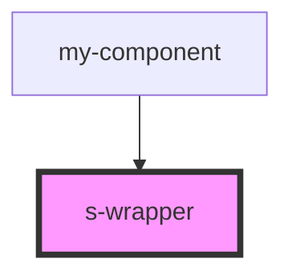

# s-wrapper

<!-- Auto Generated Below -->

## Properties

| Property     | Attribute     | Description | Type  | Default     |
| ------------ | ------------- | ----------- | ----- | ----------- |
| `forWrapper` | `for-wrapper` |             | `any` | `undefined` |

## Dependencies

### Used by

 - [my-component](../../../../my-component)

### Graph

----------------------------------------------

*Built with [StencilJS](https://stenciljs.com/)*
