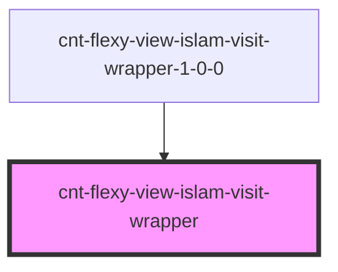

# s-wrapper

<!-- Auto Generated Below -->

## Properties

| Property      | Attribute      | Description                        | Type                              | Default     |
| ------------- | -------------- | ---------------------------------- | --------------------------------- | ----------- |
| `forCarousel` | `for-carousel` |                                    | `any`                             | `undefined` |
| `intro`       | --             | Приём данных из массива для вывода | `CntFlexyViewIslamVisitWrapper[]` | `[]`        |
| `payload`     | `payload`      |                                    | `any`                             | `undefined` |

## Events

| Event                      | Description          | Type               |
| -------------------------- | -------------------- | ------------------ |
| `clickWrapperAppImage`     | Клик по AppImage     | `CustomEvent<any>` |
| `clickWrapperGoogleImage`  | Клик по GoogleImage  | `CustomEvent<any>` |
| `clickWrapperPhoneImage`   | Клик по PhoneImage   | `CustomEvent<any>` |
| `clickWrapperProductImage` | Клик по ProductImage | `CustomEvent<any>` |
| `clickWrapperSubText`      | Клик по subtext      | `CustomEvent<any>` |
| `clickWrapperSubTitle`     | Клик по subtitle     | `CustomEvent<any>` |
| `clickWrapperText`         | Клик по тексту       | `CustomEvent<any>` |
| `clickWrapperTitle`        | Клик по title        | `CustomEvent<any>` |

## Dependencies

### Used by

 - [cnt-flexy-view-islam-visit-wrapper-1-0-0](../../..)

### Graph

----------------------------------------------

*Built with [StencilJS](https://stenciljs.com/)*
