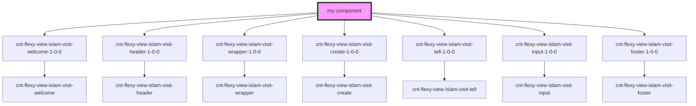

# my-component

<!-- Auto Generated Below -->

## Dependencies

### Depends on

- [cnt-flexy-view-islam-visit-welcome-1-0-0](../cnt-flexy-view-islam-visit-welcome)
- [cnt-flexy-view-islam-visit-header-1-0-0](../cnt-flexy-view-islam-visit-header)
- [cnt-flexy-view-islam-visit-wrapper-1-0-0](../cnt-flexy-view-islam-visit-wrapper)
- [cnt-flexy-view-islam-visit-create-1-0-0](../cnt-flexy-view-islam-visit-create)
- [cnt-flexy-view-islam-visit-tell-1-0-0](../cnt-flexy-view-islam-visit-tell)
- [cnt-flexy-view-islam-visit-input-1-0-0](../cnt-flexy-view-islam-visit-input)
- [cnt-flexy-view-islam-visit-footer-1-0-0](../cnt-flexy-view-islam-visit-footer)

### Graph

----------------------------------------------

*Built with [StencilJS](https://stenciljs.com/)*
